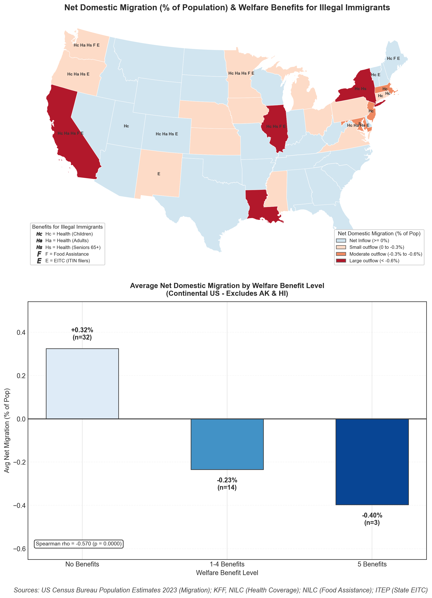
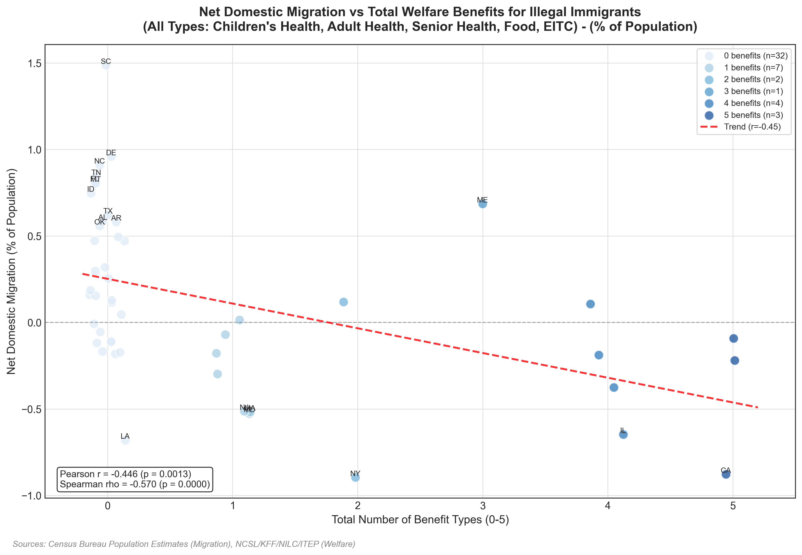
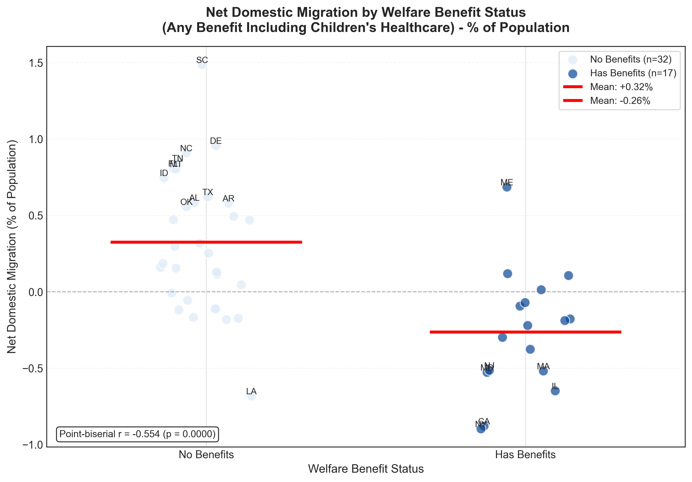
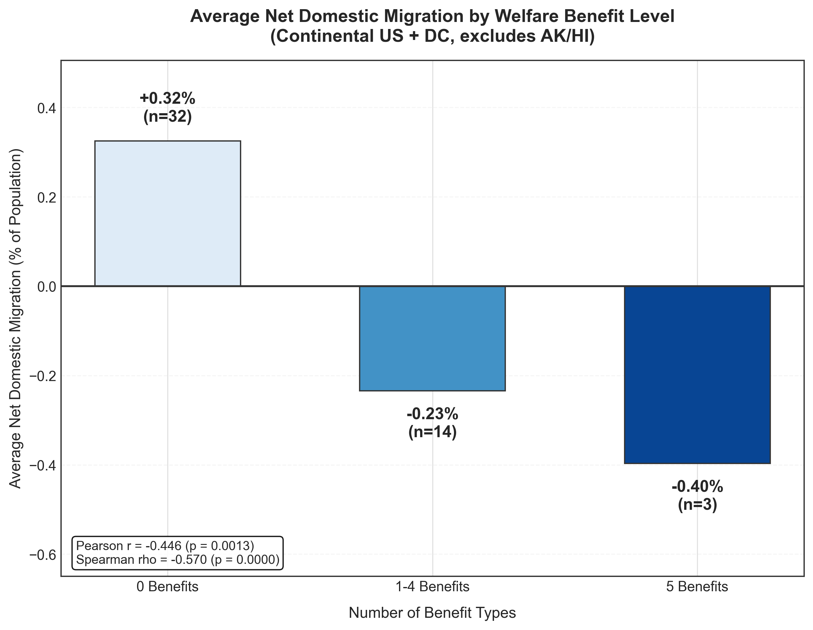
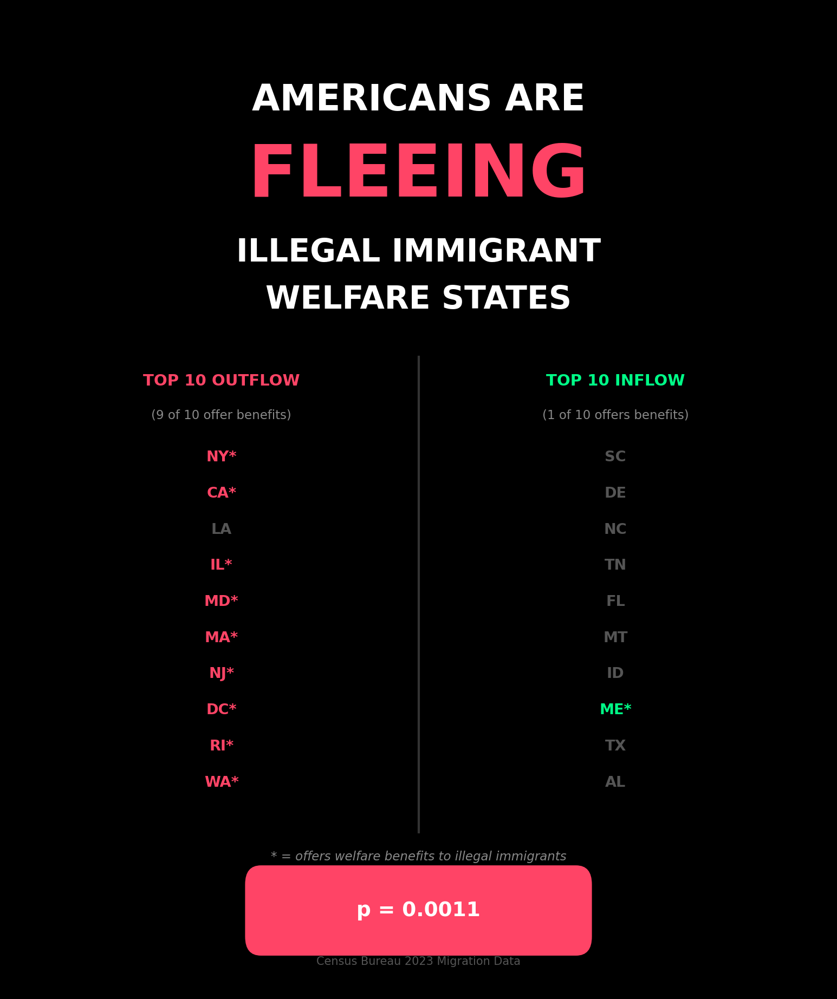

# Americans Are Fleeing Illegal Immigrant Welfare States

An analysis of the relationship between state welfare benefits for illegal immigrants and domestic migration patterns.



## Key Finding

**9 of 10 top outflow states offer welfare benefits to illegal immigrants. Only 1 of 10 top inflow states does.**

Fisher's exact test: **p = 0.0011**

---

## The Data

Using 2023 US Census Bureau domestic migration data and state welfare policy data, we find a strong negative correlation between offering welfare benefits to illegal immigrants and net population inflow.

### Correlation Statistics
| Metric | Value | p-value |
|--------|-------|---------|
| Spearman rho | -0.570 | < 0.0001 |
| Pearson r | -0.446 | 0.0013 |
| Point-biserial r | -0.554 | < 0.0001 |

### Inflow Rates
| Category | Net Inflow Rate |
|----------|----------------|
| States with **zero benefits** | **72%** (23 of 32) |
| States with **any benefits** | **24%** (4 of 17) |

---

## Visualizations

### Scatter Plot: Benefits vs Migration



States with more welfare benefits for illegal immigrants tend to have greater population outflow. Each dot represents a state, colored by the number of benefit types offered (0-5).

---

### Binary Comparison: Any Benefits vs None



Comparing states with any benefits (dark blue) to states with none (light blue). Red lines show group means:
- **No Benefits:** +0.32% average net migration
- **Has Benefits:** -0.26% average net migration

---

### Bar Chart: Migration by Benefit Level



Average net domestic migration grouped by number of welfare benefits:
- **0 Benefits:** +0.32% (n=32)
- **1-4 Benefits:** -0.23% (n=14)
- **5 Benefits:** -0.40% (n=3)

---

### Social Media Summary



---

## Top 10 States

### Top 10 Outflow States (9 of 10 offer benefits)

| Rank | State | Migration % | Benefits |
|------|-------|-------------|----------|
| 1 | New York | -0.90% | Yes |
| 2 | California | -0.88% | Yes |
| 3 | Louisiana | -0.68% | No |
| 4 | Illinois | -0.65% | Yes |
| 5 | Maryland | -0.53% | Yes |
| 6 | Massachusetts | -0.52% | Yes |
| 7 | New Jersey | -0.52% | Yes |
| 8 | District of Columbia | -0.38% | Yes |
| 9 | Rhode Island | -0.30% | Yes |
| 10 | Washington | -0.22% | Yes |

### Top 10 Inflow States (1 of 10 offers benefits)

| Rank | State | Migration % | Benefits |
|------|-------|-------------|----------|
| 1 | South Carolina | +1.49% | No |
| 2 | Delaware | +0.96% | No |
| 3 | North Carolina | +0.91% | No |
| 4 | Tennessee | +0.85% | No |
| 5 | Florida | +0.81% | No |
| 6 | Montana | +0.80% | No |
| 7 | Idaho | +0.75% | No |
| 8 | Maine | +0.69% | Yes |
| 9 | Texas | +0.63% | No |
| 10 | Alabama | +0.59% | No |

---

## Additional Statistics

### Excluding Maine (the only inflow state with benefits)

22 states have higher population inflow than Vermont (+0.12%), the next-highest inflow welfare state after Maine. **All 22 are zero-benefit states.**

---

## Data Sources

### Migration Data
- **Source:** US Census Bureau Population Estimates 2023
- **Metric:** Net domestic migration (interstate moves only)

### Welfare Policy Data
Five benefit categories tracked:

| Benefit | Source |
|---------|--------|
| Health coverage (children) | KFF, NILC |
| Health coverage (adults) | KFF, NILC |
| Health coverage (seniors 65+) | KFF, NILC |
| Food assistance | NILC |
| State EITC (ITIN filers) | ITEP |

---

## Methodology

- **Scope:** Continental US (excludes Alaska and Hawaii) — 49 states + DC
- **Migration metric:** Net domestic migration as percentage of state population
- **Benefit score:** Sum of 5 binary indicators (0-5 scale)
- **Statistical tests:** Spearman correlation, Pearson correlation, point-biserial correlation, Fisher's exact test

---

## Repository Structure

```
├── README.md
├── requirements.txt
├── data/
│   ├── state_policies.csv
│   └── net_domestic_migration_2023.csv
├── src/
│   └── analysis.py
└── output/
    ├── social_v3_headline.png
    ├── migration_any_scatter_pct.png
    ├── migration_any_scatter_binary_pct.png
    ├── migration_bars_0_1to4_5_continental.png
    └── migration_combined_final.png
```

## Usage

```bash
pip install -r requirements.txt
python src/analysis.py
```

---

## Limitations

1. **Correlation ≠ causation.** Many factors affect migration decisions.
2. **Single year.** Uses 2023 data only.
3. **Confounders.** Cost of living, taxes, climate, job markets, etc. not controlled.
4. **Binary coding.** Welfare policies have nuances not fully captured.

---

## License

MIT License
